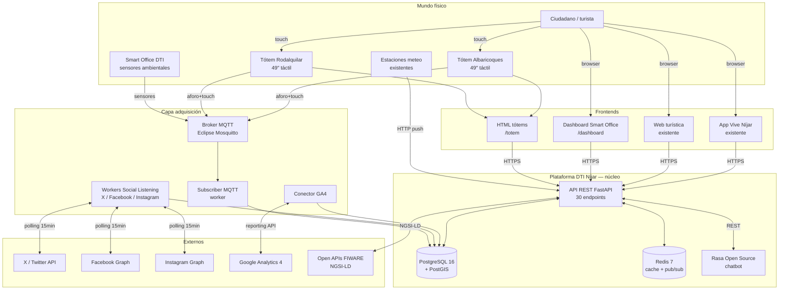
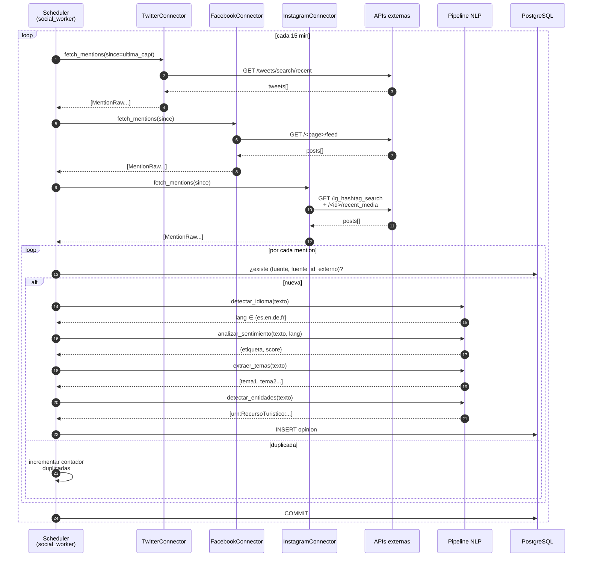
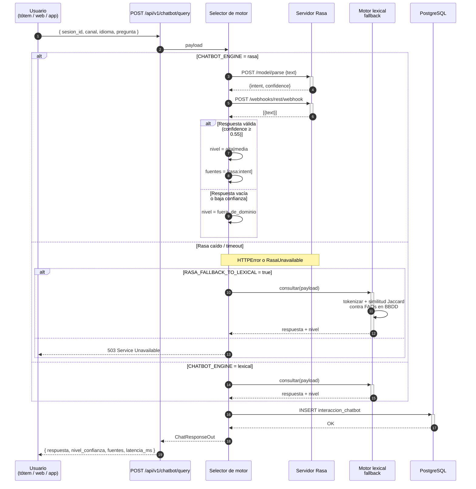
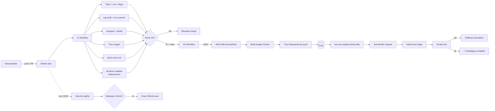

# Arquitectura técnica — Diagramas detallados

| | |
|---|---|
| **Expediente** | 18962/2025 |
| **Versión** | 1.0 (consolidado tras Hito 4) |
| **Marco** | UNE 178104 · FIWARE Smart Data Models · ENS Medio · RGPD |

Este documento amplía [`arquitectura-global.md`](arquitectura-global.md) con diagramas técnicos detallados de cada subsistema, los flujos de datos principales y las decisiones de despliegue.

---

## 1. Diagrama de bloques (alto nivel)



---

## 2. Despliegue en Kubernetes (AWS EKS)

```mermaid
flowchart TB
    subgraph internet [Internet]
        users[Usuarios / tótems / app móvil]
    end

    subgraph aws [AWS eu-central-1 — Frankfurt]
        subgraph edge [Edge]
            R53[Route53<br/>dti.nijar.es]
            ACM[ACM cert wildcard]
            WAF[WAF v2<br/>OWASP rules + RateLimit]
            ALB[Application LB<br/>internet-facing]
        end

        subgraph eks [EKS Cluster — Multi-AZ]
            subgraph nsapp [Namespace nijar-dti]
                api[Deployment nijar-api<br/>2-8 réplicas HPA]
                sub[Deployment mqtt-subscriber<br/>singleton]
                soc[Deployment social-worker<br/>singleton]
                rasa[Deployment Rasa<br/>1 réplica]
                mqtts[StatefulSet Mosquitto<br/>+ PVC gp3 5Gi]
                migrate[Job alembic<br/>helm hook]
            end

            subgraph nsmon [Namespace monitoring]
                prom[Prometheus]
                graf[Grafana]
                alm[AlertManager]
                loki[Loki]
                pt[Promtail DaemonSet]
            end

            subgraph nsesi [Namespace external-secrets]
                eso[External Secrets Operator]
            end

            subgraph nslbc [Namespace kube-system]
                lbc[AWS LB Controller]
                ebs[EBS CSI Driver]
            end
        end

        subgraph stateful [Servicios gestionados]
            rds[(RDS PostgreSQL 16<br/>Multi-AZ + KMS)]
            cache[(ElastiCache Redis 7<br/>Multi-AZ + TLS)]
            sm[(Secrets Manager<br/>+ KMS rotación)]
            ecr[(ECR<br/>imágenes Docker)]
            s3b[(S3 backups<br/>+ Glacier 90d)]
            backup[AWS Backup vault<br/>+ vault lock 365d]
            cw[CloudWatch Logs<br/>VPC Flow + RDS]
        end
    end

    users -->|HTTPS 443| R53
    R53 --> ALB
    ALB --> WAF
    WAF --> api
    api <--> rds
    api <--> cache
    sub <--> mqtts
    sub --> rds
    soc --> rds
    api <-->|REST| rasa
    eso <-->|refresh 1h| sm
    eso --> nsapp
    rds <-.snapshot.- backup
    s3b <-.archivar.- backup
    api -->|metrics| prom
    pt -->|logs| loki
    prom --> alm
    graf --> prom & loki
    api -->|logs| cw
```

### Multi-AZ y tolerancia a fallos

| Componente | AZ-1a | AZ-1b | AZ-1c |
|------------|:-----:|:-----:|:-----:|
| EKS workers | ✓ | ✓ | ✓ |
| RDS primary | ✓ | | |
| RDS standby | | ✓ | |
| Redis primary | ✓ | | |
| Redis replica | | ✓ | |
| NAT Gateway | ✓ | | |
| ALB endpoints | ✓ | ✓ | ✓ |

Failover automático en RDS (≈60-120 s) y Redis (≈15 s). Los pods se reparten con `topologySpreadConstraints` por AZ.

---

## 3. Modelo de datos — entidades principales

```mermaid
erDiagram
    USUARIO ||--o{ INTERACCION_CHATBOT : "ejecuta"
    USUARIO ||--o{ CONTENIDO : "publica"
    USUARIO {
        uuid id PK
        string email UK
        string nombre_completo
        string rol
        boolean dos_factor_habilitado
        timestamp created_at
    }

    RECURSO_TURISTICO ||--o{ EVENTO_TURISTICO : "alberga"
    RECURSO_TURISTICO ||--o{ SERVICIO : "ofrece"
    RECURSO_TURISTICO ||--o{ VISITA : "recibe"
    RECURSO_TURISTICO {
        uuid id PK
        string urn UK "FIWARE NGSI-LD"
        string nombre
        string categoria
        jsonb nombre_i18n "ES/EN/DE/FR"
        jsonb descripcion_i18n
        geometry ubicacion "POINT GPS"
        boolean publicado
    }

    EVENTO_TURISTICO {
        uuid id PK
        string urn UK
        string nombre
        timestamp fecha_inicio
        timestamp fecha_fin
        uuid recurso_id FK
    }

    SERVICIO {
        uuid id PK
        string urn UK
        string tipo "alojamiento, restauracion, transporte"
        uuid recurso_id FK
    }

    SENSOR ||--o{ OBSERVACION : "produce"
    SENSOR {
        uuid id PK
        string urn UK "FIWARE Device"
        string nombre
        string tipo
        string estado
        geometry ubicacion
        jsonb umbrales "min/max alerta"
    }

    OBSERVACION {
        uuid id PK
        uuid sensor_id FK
        timestamp observado_en
        float valor
        jsonb valores "multivariable"
        boolean valido
    }

    OPINION ||--o{ TEMA : "menciona"
    OPINION {
        uuid id PK
        string fuente "twitter_x|facebook|instagram"
        string fuente_id_externo
        string texto_original
        string idioma
        string sentimiento
        float score_sentimiento
        jsonb metricas
        timestamp publicado_en
    }

    FAQ ||--o{ INTERACCION_CHATBOT : "responde"
    FAQ {
        uuid id PK
        string intent UK
        jsonb pregunta_i18n
        jsonb respuesta_i18n
        string categoria
    }

    INTERACCION_CHATBOT {
        uuid id PK
        string sesion_id
        string canal "totem|web|app"
        string idioma
        text pregunta
        text respuesta
        string intent_detectado
        string nivel_confianza
        float score_confianza
        int latencia_ms
    }

    CONTENIDO {
        uuid id PK
        string canal "totem|web|app"
        string tipo
        jsonb contenido_i18n
        string estado "borrador|publicado|archivado"
        timestamp publicado_desde
        timestamp publicado_hasta
    }

    VISITA {
        uuid id PK
        string tipo "totem_interaccion|web_vista|app_vista"
        uuid recurso_id FK
        string visitante_hash "SHA-256 anonimo"
        timestamp ocurrido_en
    }
```



11 tablas principales en PostgreSQL 16 + PostGIS. Todas heredan del `AuditMixin` (created_at, updated_at, created_by, updated_by, deleted_at) y todas las entidades FIWARE llevan campo `urn` único.

---

## 4. Flujo de ingesta IoT (sensor → BBDD)

```mermaid
sequenceDiagram
    autonumber
    participant S as Sensor físico<br/>(Smart Office / tótem)
    participant M as Broker MQTT<br/>Mosquitto
    participant W as Worker<br/>mqtt_subscriber
    participant L as asyncio Loop<br/>(thread aparte)
    participant D as PostgreSQL<br/>+ PostGIS

    S->>+M: PUBLISH nijar/sensors/<slug>/<measurement>
    Note right of S: Payload JSON<br/>{valor, unidades, observado_en}
    M->>+W: on_message callback (síncrono)
    W->>W: parse_message(topic, payload)
    Note right of W: Validación URN, rango,<br/>timestamp, schema Pydantic
    alt Mensaje inválido
        W->>W: Incrementa contador<br/>mensajes_invalidos
        W-->>M: ACK silencioso
    else Mensaje válido
        W->>L: run_coroutine_threadsafe()
        L->>+D: SELECT sensor por URN
        alt Sensor no encontrado
            D-->>L: None
            L->>L: Persistir con valido=False<br/>+ contador sensores_no_encontrados
        else Sensor encontrado
            D-->>L: Sensor + umbrales
            L->>L: Validar rango<br/>(min ≤ valor ≤ max)
            L->>+D: INSERT INTO observacion
            D-->>-L: OK
            L->>L: Incrementa<br/>mensajes_validos
        end
    end
    L-->>-W: future.done
```

El subscriber **nunca bloquea el callback de MQTT**: la persistencia se delega al loop asyncio dedicado. Las métricas Prometheus se publican en `/metrics` de la API y se visualizan en Grafana.

---

## 5. Flujo de Social Listening



En modo `SOCIAL_DRY_RUN=true` los conectores devuelven menciones sintéticas en 4 idiomas, lo que permite operar sin tokens hasta que el Ayuntamiento los entregue.

---

## 6. Flujo del chatbot IA — selector de motor con failover



El **failover** garantiza disponibilidad del chatbot incluso si Rasa cae. La generación de los artefactos `domain.yml`, `nlu.yml`, `rules.yml` y `stories.yml` se hace automáticamente desde las FAQs del seed con `python -m nijar_dti.workers.rasa_generator`.

---

## 7. Flujo de autenticación OAuth2 + RBAC

```mermaid
sequenceDiagram
    autonumber
    participant U as Cliente<br/>(dashboard, app)
    participant API as API REST
    participant AUTH as auth_service
    participant DB as PostgreSQL
    participant DEP as Dependency<br/>require_role

    U->>API: POST /auth/login<br/>{email, password}
    API->>+AUTH: login()
    AUTH->>DB: SELECT usuario WHERE email
    DB-->>AUTH: usuario + hash bcrypt
    AUTH->>AUTH: verify_password(plain, hash)
    AUTH->>AUTH: emitir JWT access (60min)<br/>+ refresh (7d)
    AUTH-->>-API: {access_token, refresh_token}
    API-->>U: 200 OK

    Note over U,API: Peticiones autenticadas

    U->>API: GET /tourism/resources<br/>Authorization: Bearer <jwt>
    API->>+DEP: get_current_user()
    DEP->>DEP: decode JWT, validar exp/iss
    DEP->>DB: SELECT usuario por sub
    DB-->>DEP: usuario
    DEP->>+DEP: require_role(["gestor_contenidos", "auditor"])
    DEP-->>-API: usuario autenticado y autorizado
    API->>DB: query datos
    DB-->>API: resultados
    API-->>-U: 200 + JSON

    Note over U,API: Refresh transparente

    U->>API: GET /...<br/>(401 access expirado)
    U->>API: POST /auth/refresh<br/>{refresh_token}
    API->>AUTH: rotar tokens
    AUTH-->>API: {access_token nuevo, refresh_token nuevo}
    API-->>U: 200 OK
    U->>API: reintentar petición original
```

5 roles: `administrador_tic`, `gestor_contenidos`, `analista_datos`, `operador_smart_office`, `auditor`. Cada endpoint declara los roles que lo pueden invocar.

---

## 8. Despliegue continuo (CI/CD)



---

## 9. Stack tecnológico consolidado

| Capa | Tecnología | Versión | Justificación |
|------|------------|---------|---------------|
| Backend API | FastAPI + Pydantic v2 | latest stable | Async, OpenAPI nativo, validación robusta |
| ORM | SQLAlchemy 2.0 + asyncpg | 2.0+ | Async nativo, dataclasses |
| BBDD | PostgreSQL + PostGIS | 16.3 / 3.x | GIS + JSONB + extensibilidad |
| Cache | Redis | 7.1 | Multi-AZ y pub/sub |
| Mensajería IoT | Eclipse Mosquitto | 2.0.18 | Estándar MQTT abierto |
| NLP propio | Lexicón + Jaccard | — | Sin deps pesadas, multilingüe |
| Chatbot | Rasa Open Source | 3.6.20 | DIET + auto-generado desde FAQs |
| Migraciones | Alembic | latest | Versionado declarativo |
| Logs | structlog + Loki | 24.x / 2.x | JSON estructurado |
| Métricas | prometheus-client + Prometheus + Grafana | latest | Dashboard portable |
| Frontend | HTML + Tailwind CDN + Chart.js + Leaflet | — | Sin build step |
| IaC | Terraform | 1.6+ | Estado declarativo S3 + DynamoDB |
| Orquestación | Kubernetes (EKS) | 1.30 | Portabilidad multi-cloud |
| CI/CD | GitHub Actions + OIDC | — | Sin secretos rotables |
| Seguridad CI | pip-audit + osv-scanner + semgrep + bandit + Trivy + axe-core | — | Defensa en profundidad |

---

## 10. Conformidad normativa por componente

| Norma | Cómo se cumple |
|-------|-----------------|
| **UNE 178104** | Arquitectura modular tres capas, interoperabilidad NGSI-LD |
| **UNE 178501/2** | Indicadores DTI alimentados por dashboards y informe mensual |
| **FIWARE Smart Data Models** | URNs FIWARE en todas las entidades + 7 JSON Schemas validados |
| **ENS Nivel Medio** | KMS, MFA admin, VPC Flow Logs, audit logs, backups multinivel, pentest pre-SAT |
| **RGPD + LOPDGDD** | Datos en eu-central-1, anonimización SHA-256 con salt, retention configurable, DPO informado |
| **WCAG 2.1 AA** | Dashboard y tótems auditados con axe-core en CI; documento de cumplimiento detallado |
| **DNSH** | Cómputo eficiente, gp3 (más eficiente que gp2), región con energía renovable certificada AWS |
| **ISO 27001 / 9001 / 14001 / 42001 / 45001** | SIG IT DIGITTAL aplicado |
