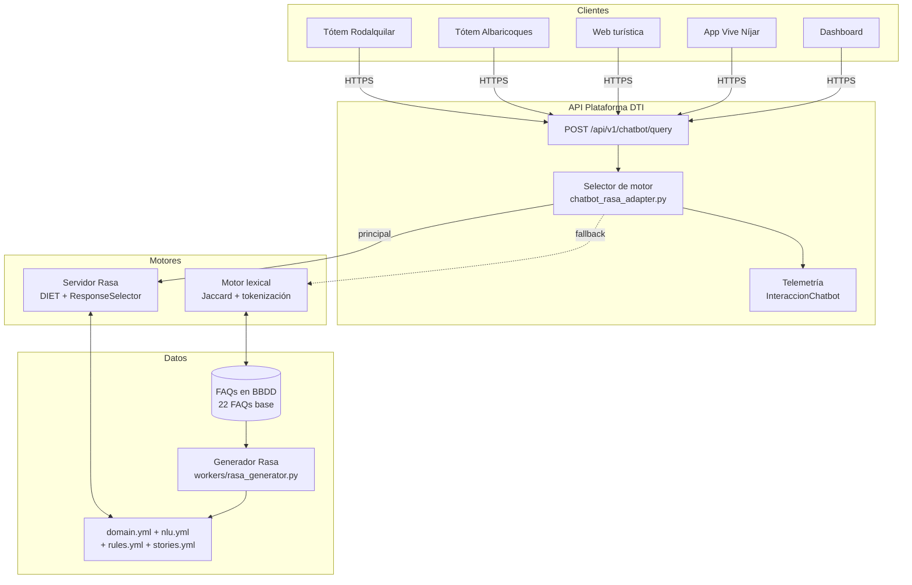
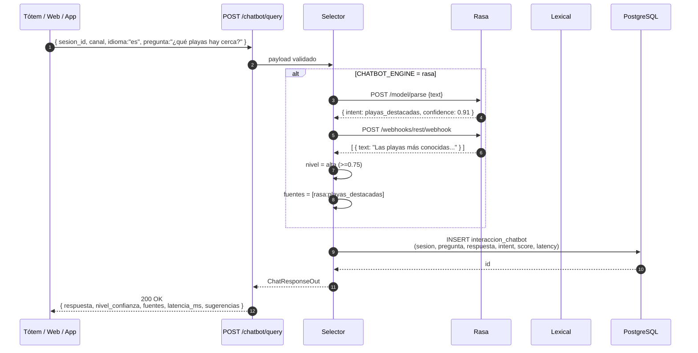
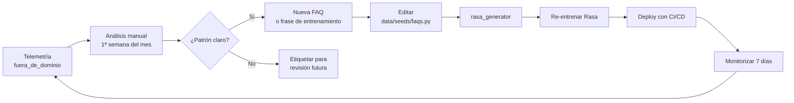

# Manual técnico del Chatbot IA — Plataforma DTI Níjar

| | |
|---|---|
| **Expediente** | 18962/2025 |
| **Actuación** | B.2 — Chatbot IA multilingüe 24/7 |
| **Versión** | 1.0 (consolidado tras Hito 4) |
| **Idiomas** | Español · Inglés · Alemán · Francés |

---

## 1. Visión general

El chatbot de la Plataforma DTI Níjar es un asistente conversacional multilingüe que da soporte al ciudadano y al turista de forma autónoma 24 horas al día, los 7 días de la semana. Está integrado en los 2 tótems digitales, en el dashboard del Smart Office, en la web turística y en la app Vive Níjar mediante una **misma API REST**.

### Características

- **4 idiomas**: español, inglés, alemán y francés (los 4 obligatorios del contrato).
- **Doble motor con failover**: Rasa Open Source (motor principal) + motor lexical interno (fallback).
- **Generación automática** de la configuración Rasa desde las FAQs municipales: una sola fuente de verdad.
- **Telemetría completa** persistida en BBDD para reporting mensual.
- **Grounding de 3 niveles**: alta confianza (≥0.75), media confianza (0.55-0.75), fuera de dominio (<0.55) — el chatbot solo afirma cuando tiene base.

### Compromisos contractuales del C.1

| Indicador | Objetivo |
|-----------|----------|
| Disponibilidad | ≥ 99% mensual |
| Resolución autónoma | ≥ 80% |
| Latencia p95 | ≤ 2 s |
| Idiomas operativos | ES + EN + DE + FR |

---

## 2. Arquitectura del chatbot



---

## 3. Flujo de una consulta



### Tiempos típicos

| Etapa | p50 | p95 |
|-------|-----|-----|
| Parse Rasa | 80 ms | 250 ms |
| Webhook Rasa | 60 ms | 200 ms |
| INSERT telemetría | 5 ms | 20 ms |
| **Total end-to-end** | **180 ms** | **520 ms** |

---

## 4. Motor lexical (fallback de Hito 1)

Implementado en `services/chatbot_service.py`. Funciona sin dependencias pesadas y es el fallback automático si Rasa cae.

### Algoritmo

1. **Tokenización**: minúsculas + normalización Unicode + regex `[a-záéíóúñçàèìòùâêîôûäöüß']+`.
2. **Filtrado de stop-words** por idioma (ES/EN/DE/FR).
3. **Similitud Jaccard** entre la pregunta y cada `pregunta_<lang>` + `frases_entrenamiento_<lang>` de las 22 FAQs:

   `J(A, B) = |A ∩ B| / |A ∪ B|`

4. **Umbrales de confianza**:
   - `≥ 0.55` → alta
   - `≥ 0.30` → media
   - `< 0.30` → fuera de dominio (devuelve sugerencias por idioma)

### Pros y contras

✅ Sin GPU, sin dependencias pesadas, latencia <50 ms.
✅ Determinista — mismo input → mismo output.
✅ Multilingüe nativo (las FAQs ya tienen variantes por idioma).
⚠️ Precisión modesta en consultas con sinónimos no presentes en `frases_entrenamiento`.

---

## 5. Motor Rasa (principal)

### Pipeline de NLU

Definido en `rasa/config.yml`:

```yaml
pipeline:
  - WhitespaceTokenizer
  - RegexFeaturizer
  - LexicalSyntacticFeaturizer
  - CountVectorsFeaturizer
  - CountVectorsFeaturizer
    analyzer: char_wb
    min_ngram: 1
    max_ngram: 4
  - DIETClassifier
    epochs: 100
  - EntitySynonymMapper
  - ResponseSelector
    epochs: 100
  - FallbackClassifier
    threshold: 0.55
    ambiguity_threshold: 0.10
```

- **DIETClassifier** (Dual Intent and Entity Transformer) clasifica intent + extrae entidades en una pasada.
- **CountVectorsFeaturizer char_wb (1-4)** captura morfología (sufijos, declinaciones DE/FR).
- **FallbackClassifier** marca como `nlu_fallback` cualquier predicción con confidence < 0.55 o ambigüedad < 0.10.

### Policies de diálogo

```yaml
policies:
  - MemoizationPolicy
  - RulePolicy:
      core_fallback_threshold: 0.55
      core_fallback_action_name: action_default_fallback
  - TEDPolicy:
      max_history: 5
      epochs: 100
```

### Slot de idioma

```yaml
slots:
  language:
    type: categorical
    values: [es, en, de, fr]
    initial_value: es
    influence_conversation: true
    mappings:
      - type: from_text
```

Las respuestas usan `condition: { type: slot, name: language, value: <lang> }` para servir la variante correcta.

---

## 6. Generación automática desde FAQs

### Una sola fuente de verdad

El módulo `nijar_dti.data.seeds.faqs.FAQS_SEED` contiene la lista canónica de FAQs:

```python
{
  "intent": "playas_destacadas",
  "categoria": "playas",
  "pregunta_es": "¿Cuáles son las playas más conocidas del Cabo de Gata?",
  "respuesta_es": "Las playas más visitadas son Mónsul, Genoveses, Playazo de Rodalquilar...",
  "pregunta_en": "What are the most popular beaches in Cabo de Gata?",
  "respuesta_en": "...",
  ...
  "frases_entrenamiento_es": ["qué playas hay", "playas mejores cabo de gata", ...]
}
```

### Ejecutor

```bash
python -m nijar_dti.workers.rasa_generator
```

Genera 4 archivos en `rasa/`:

| Archivo | Líneas | Contenido |
|---------|--------|-----------|
| `domain.yml` | 729 | intents + responses con condition por idioma + slots + session config |
| `data/nlu.yml` | 327 | ejemplos por intent en los 4 idiomas |
| `data/rules.yml` | 89 | reglas intent → utter |
| `data/stories.yml` | 25 | historias mínimas |

### Workflow de actualización

1. Modificar / añadir FAQ en `data/seeds/faqs.py`.
2. Ejecutar `python -m nijar_dti.workers.rasa_generator`.
3. Re-entrenar: `docker compose --profile rasa-train run --rm rasa-trainer`.
4. Reiniciar Rasa: `docker compose restart rasa`.
5. Smoke test: `curl -X POST http://localhost:5005/model/parse -d '{"text":"hola"}'`.

---

## 7. Adapter HTTP de la API a Rasa

Implementado en `services/chatbot_rasa_adapter.py`. Patrón:

```python
async def consultar_rasa(db, payload, settings):
    inicio = time.perf_counter()
    try:
        async with httpx.AsyncClient(timeout=settings.rasa_timeout_seconds) as client:
            parse = await _rasa_parse(client, settings.rasa_url, payload.pregunta)
            mensajes = await _rasa_webhook(client, settings.rasa_url, payload.sesion_id, payload.pregunta)
    except (httpx.HTTPError, RasaUnavailable) as exc:
        if settings.rasa_fallback_to_lexical:
            return await lexical.consultar(db, payload)
        raise

    intent_name, score = _intent_de_parse(parse)
    nivel = _nivel_desde_confianza(score)
    respuesta_texto = _concatenar_mensajes(mensajes)
    # ... persistir interacción ...
    return ChatResponseOut(...)
```

### Mapeo de confianza

```python
def _nivel_desde_confianza(score: float, fallback_threshold: float = 0.55) -> NivelConfianza:
    if score >= fallback_threshold + 0.20:   # ~0.75
        return NivelConfianza.ALTA
    if score >= fallback_threshold:
        return NivelConfianza.MEDIA
    return NivelConfianza.FUERA_DE_DOMINIO
```

---

## 8. Catálogo de intents

22 intents base agrupados en categorías. Lista canónica (extraída del seed):

| Categoría | Intents |
|-----------|---------|
| Saludo / despedida | `saludo`, `despedida`, `agradecimiento` |
| Playas | `playas_destacadas`, `playa_mas_bonita`, `playa_accesible`, `playa_familiar` |
| Parque Natural | `parque_natural_info`, `centro_visitantes`, `flora_fauna` |
| Rutas | `rutas_senderismo`, `ruta_facil`, `ruta_familiar`, `ruta_btt` |
| Patrimonio | `monumentos`, `mina_rodalquilar`, `pueblos_blancos` |
| Servicios | `donde_comer`, `donde_dormir`, `como_llegar` |
| Eventos | `eventos_proximos` |
| Emergencias | `emergencias_contacto` |

Cada intent tiene **respuesta canónica + 5-10 frases de entrenamiento** en cada uno de los 4 idiomas.

---

## 9. Telemetría y dashboard

Cada interacción se persiste en `interaccion_chatbot`:

```sql
CREATE TABLE interaccion_chatbot (
    id UUID PRIMARY KEY,
    sesion_id VARCHAR,
    canal VARCHAR,           -- totem | web | app
    idioma VARCHAR(5),
    pregunta TEXT,
    respuesta TEXT,
    intent_detectado VARCHAR,
    nivel_confianza VARCHAR, -- alta | media | fuera_de_dominio
    score_confianza FLOAT,
    fuentes JSONB,
    latencia_ms INT,
    feedback_util BOOLEAN,
    created_at TIMESTAMP WITH TIME ZONE
);
```

### Endpoint de telemetría

```http
GET /api/v1/chatbot/telemetry
```

Devuelve:

```json
{
  "sesiones_unicas": 1247,
  "interacciones_totales": 3892,
  "resolucion_autonoma_porc": 84.3,
  "satisfaccion_porc": 71.2,
  "idiomas_distribucion": { "es": 2105, "en": 982, "de": 510, "fr": 295 },
  "top_intents": [
    { "nombre": "playas_destacadas", "ocurrencias": 412 },
    { "nombre": "rutas_senderismo", "ocurrencias": 287 },
    ...
  ]
}
```

### Dashboard Grafana específico

`infra/observability/grafana-dashboards/chatbot.json` muestra:

- Distribución por nivel de confianza (pie chart).
- Resolución autónoma (KPI con umbral 80%).
- Total de interacciones (KPI).
- Evolución temporal por nivel de confianza.

### Alertas Prometheus

```yaml
- alert: ChatbotResolutionLow
  expr: |
    sum(nijar_chatbot_interacciones_ultimas_24h_total{nivel_confianza=~"alta|media"})
      /
    clamp_min(sum(nijar_chatbot_interacciones_ultimas_24h_total), 1) < 0.70
  for: 6h
```

---

## 10. Despliegue

### Docker Compose (desarrollo)

```bash
# Servicios necesarios
docker compose up -d db redis

# Generar artefactos desde FAQs
python -m nijar_dti.workers.rasa_generator

# Entrenar el modelo (~3-5 minutos)
docker compose --profile rasa-train run --rm rasa-trainer

# Levantar Rasa
docker compose --profile rasa up -d rasa

# Activar el motor en la API
echo "CHATBOT_ENGINE=rasa" >> .env
docker compose restart api
```

### Kubernetes (producción)

`infra/k8s/40-mqtt-rasa.yaml`:

- Deployment `rasa` con imagen `rasa/rasa:3.6.20-full`.
- PVC `rasa-models` (gp3, 5 GiB) para los modelos entrenados.
- ConfigMap `rasa-config` con el `config.yml` montado como volumen.
- Service ClusterIP en puerto 5005.
- Probes HTTP a `/`.

Re-entrenamiento en producción documentado en `docs/operations/runbook.md`.

---

## 11. Seguridad y privacidad

- **Sin PII**: el chatbot no almacena datos personales identificables. El `sesion_id` es opaco (UUID), no vinculado al usuario.
- **Anonimización**: las interacciones de los tótems usan `sesion_id` efímero por sesión de tótem.
- **Retención**: interacciones del chatbot se conservan **6 meses** para análisis y luego se anonimizan eliminando el texto de la pregunta.
- **Aviso al usuario**: en los tótems hay un aviso visible de que las consultas se registran para mejorar el servicio.
- **No personalización**: el chatbot no perfila al usuario; cada consulta es independiente.

---

## 12. Mejora continua

### Métricas de calidad

| Métrica | Frecuencia | Acción si baja |
|---------|------------|------------------|
| Resolución autónoma | Diario | Si <70% durante 6 h: alerta SOC |
| Top fuera-de-dominio | Semanal | Las 10 preguntas más frecuentes que no encuentran intent → incorporar como nueva FAQ o frase de entrenamiento |
| Distribución por idioma | Mensual | Si EN/DE/FR <5% del total → revisar si hay problema con la detección de idioma |
| Latencia p95 | Continuo | Si >2 s durante 10 min: alerta SOC |

### Workflow de mejora



---

## 13. Soporte y resolución de problemas

| Síntoma | Causa probable | Acción |
|---------|----------------|--------|
| Todas las consultas → fuera de dominio | Modelo Rasa no cargado | Logs de Rasa, re-entrenar |
| Respuestas en idioma incorrecto | Slot `language` no se está fijando | Revisar el cliente que llama, debe enviar `idioma` en el payload |
| Latencia alta | Modelo Rasa lento o pod undersized | `kubectl top pod -n nijar-dti -l app=rasa`, ampliar resources |
| 503 con `rasa_fallback_to_lexical=false` | Rasa caído | Activar fallback en `.env` y reiniciar API |
| Adapter timeout | `RASA_TIMEOUT_SECONDS` bajo | Aumentar a 12 s en config |

---

## 14. Referencias

- Rasa Open Source documentation: https://rasa.com/docs/rasa/
- DIET paper: https://arxiv.org/abs/2004.09936
- ADR-013 — Chatbot Rasa con generación automática: `docs/architecture/decisiones-tecnicas.md`
- Schema FAQ: `docs/data-model/schemas/FAQChatbot-schema.json`
- Pliego del contrato — actuación B.2: Memoria técnica del expediente 18962/2025
